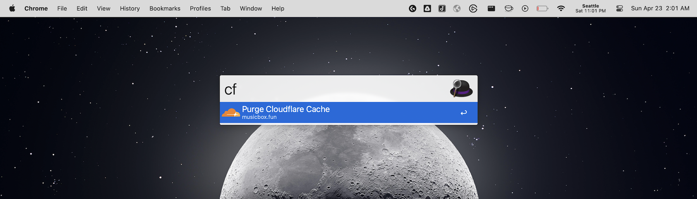
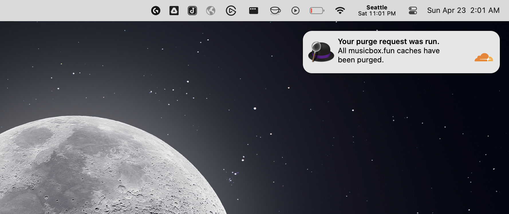

# Cloudflare Purge Alfred Workflow

Purges the Cloudflare cache for a website.

## Setup

1. Download the latest version of the extension file (`Cloudflare Purge.alfredworkflow`) and double-click it to load it into Alfred.
2. A window will open with some extension setup instructions. It will ask for the following:
    * An Cloudflare API token with permissions to purge cache ([see details here](https://developers.cloudflare.com/fundamentals/api/get-started/create-token/) ).
    * A Zone ID for the zone you want to purge ([see details here](https://developers.cloudflare.com/fundamentals/get-started/basic-tasks/find-account-and-zone-ids/) ).
    * A website name for the site being purged (optional).

## Using the extension

Launch Alfred and type "cf" to see the cache purge option.

## License

MIT
